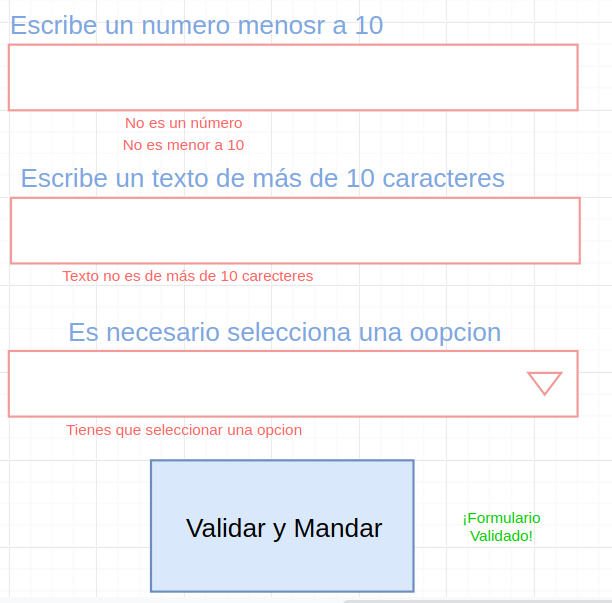

# js-seeds-intro

## Ejercicio DOM

Agregar las siguiente funciones al ejemplo de CMS
  - Ponerle un tachesito de quitar a cada elemento que se agregas (titulo, parrafo, imagen o video)
  - Poner un icono donde si dejo picado puedo arrastrar y cambiar el orden de los elementos 

- [Documentacion Laboratoria](https://github.com/Laboratoria/curricula-js/tree/5c41fadf02dbda7e2709d4b6b7c5b6ef48a7ae11/topics/javascript)

## DOM

Arbol de documentos (objetos) que se traduce del html
Se asemeja a un árbol de carpetas
Cada elemento guarda las características del tag: estilo, clases, atributos

### Manipular Dom

```
document.getElemntById('un-id') 
// HTMLDocument

document.getElemntsByClassName('una-clase') 
//HTMLCollection

document.getElemntsByName('un-name') 
//HTMLCollection

document.getElemntsByTagName('un-tag-name') 
//HTMLCollection

```

```
let tag = document.createElement('tag') // div, span, button
let element = document.getElementById('un-id')
element.append(tag)

element.remove()
```

```
let element = document.getElementById('un-id')
element.classNames = 'blue red error'
```

Un HTMLCollection 


Div.nums > 5 divs [1..5]

button funcion que le sume 1 a cada div dentro de .nums


Ejercicio formulario

Que valide las siguiente opciones

